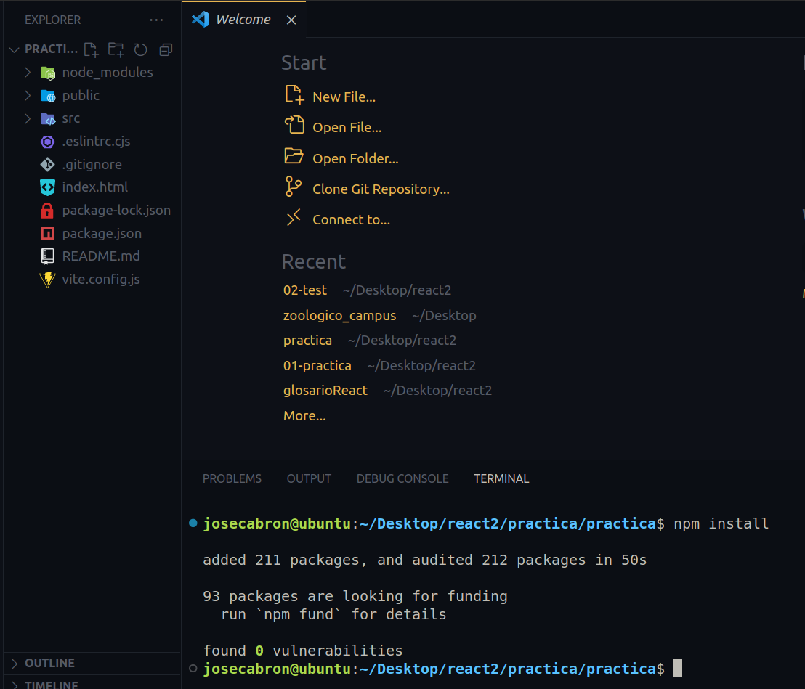
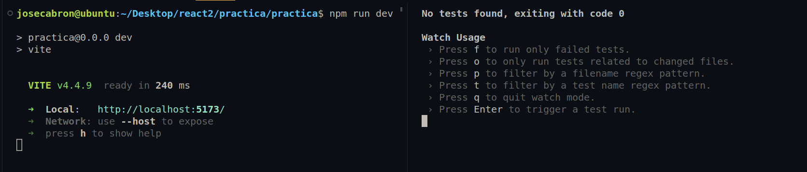

# GLOSARIO REACT

## QUÉ ES REACT??

React es una librería de JavaScript de código abierto diseñada para crear interfaces de usuario. Fue lanzada en 2013 por Facebook y es mantenida actualmente por Facebook y una comunidad de desarrolladores independientes.

React se basa en el concepto de componentes, que son unidades reutilizables de código que se pueden combinar para crear interfaces complejas. Cada componente tiene su propio estado y lógica, y React se encarga de actualizar la interfaz de usuario de forma eficiente cuando se cambian los datos.

### React tiene una serie de ventajas, entre las que se incluyen:

*Rendimiento*: React es muy eficiente en el uso de recursos, lo que lo hace ideal para aplicaciones web dinámicas.

*Mantenimiento*: React es fácil de mantener y escalar, gracias a su arquitectura de componentes.

*Comunidad*: React tiene una gran comunidad de desarrolladores que ofrecen soporte y recursos.
React es una herramienta popular para el desarrollo de aplicaciones web, y es utilizada por empresas como Airbnb, Netflix y GitHub.

### Características principales de React:

*Componentes*: React se basa en el concepto de componentes, que son unidades reutilizables de código que se pueden combinar para crear interfaces complejas.

*Virtual DOM*: React utiliza un virtual DOM para representar el estado de la interfaz de usuario. El virtual DOM es una representación interna de la interfaz de usuario que se actualiza de forma eficiente cuando se cambian los datos.

*Declarativa*: React utiliza una sintaxis declarativa para describir el estado de la interfaz de usuario. Esto hace que el código sea más fácil de leer y mantener.

*Eficientemente*: React es muy eficiente en el uso de recursos, lo que lo hace ideal para aplicaciones web dinámicas.

*Compatibilidad con IE*: React 18 es compatible con todos los navegadores modernos, incluidos Edge, Firefox, Chrome y Safari. Sin embargo, si es necesario admitir versiones anteriores de IE, se puede utilizar unpolyfill.

*Conexión con Java*: React se puede conectar con Java de varias maneras. Una forma es utilizar una librería como react-dom-server para renderizar la interfaz de usuario de React en el lado del servidor. Otra forma es utilizar una librería como react-router-dom para manejar la navegación entre páginas.

# COMO TRABAJAREMOS REACT EN LOS PROXIMOS PROYECTOS???

En nuestro caso vamos a usar *"VITE"*, para la instalacion de nuestra configuracion

## QUÉ ES VITE??

Vite es una herramienta de desarrollo web de próxima generación que combina un servidor de desarrollo rápido y un sistema de compilación eficiente. Está diseñado para ser simple, flexible y fácil de usar.

### Ventajas de Vite:

*Rendimiento*: Vite es muy rápido, tanto para el desarrollo como para la producción. El servidor de desarrollo de Vite se inicia en milisegundos y la compilación de producción se completa en segundos.

*Flexibilidad*: Vite es compatible con una amplia gama de tecnologías, incluidos JavaScript, TypeScript, React, Vue y Svelte.

*Facilidad de uso*: Vite es fácil de aprender y usar. No requiere ninguna configuración compleja y tiene una curva de aprendizaje corta.

### Características principales de Vite:

*Servidor de desarrollo rápido*: El servidor de desarrollo de Vite se inicia en milisegundos y proporciona una experiencia de desarrollo fluida.

*Sistema de compilación eficiente*: Vite utiliza Rollup para compilar el código de producción de forma eficiente.
Compatibilidad con múltiples tecnologías: Vite es compatible con una amplia gama de tecnologías, incluidos JavaScript, TypeScript, React, Vue y Svelte.

*Facilidad de uso*: Vite es fácil de aprender y usar. No requiere ninguna configuración compleja y tiene una curva de aprendizaje corta.
Vite es una herramienta popular para el desarrollo web, y es utilizada por empresas como Google, Microsoft y Shopify.

## Instalacion de Vite en Nuestros Proyectos:

Para instalar Vite, debemos tener instalado previamente *node* y su manejador de packetes *npm*, ahora vamos a abrir la consola y ejeccutamos el siguiente comando:


```js
    npm create vite
```
Este Generara la configuracion Inicial, aca vamos a poner el nombre de nuestro proyecto:


Ahora vamos a elegir la opcion <span style="color:blue;">React</span>


Luego elegimos la opcion <span style="color:YELLOW;">JavaScript + swc</span>, ya que vamos a trabajar con <span style="color:yellow;">Js</span>


Observamos que nuestra configuracion ya termina en este punto:


Y nuestras carpetas ya se generaron automaticamente en nuestro proyecto:


Con esto quedaria configurado *"Vite"*,
ahora para testear instalaremos las dependencias *"Jest"* y *"Babel*

## Qué es Jest y Cómo instalar Jest??

Jest es un framework de pruebas JavaScript de código abierto desarrollado por Facebook. Es un marco de prueba completo que incluye una biblioteca de afirmaciones, un corredor de pruebas y soporte para pruebas unitarias, de integración y de aceptación.

Jest es una buena opción para probar aplicaciones React, ya que está diseñado específicamente para ello. Sin embargo, también se puede utilizar para probar cualquier aplicación JavaScript.

Ahora abriremos la consola nuevamente despues de haber instalado el vite y ejecutamos el siguiente comando:

```js
    npm install --save-dev jest
```


Una vez instalado, instalaremos *"Babel"*

## Qué es Babel y Cómo instalar Babel??


Babel es un compilador JavaScript que transforma el código JavaScript moderno en código compatible con navegadores antiguos y entornos no compatibles.

Babel se utiliza para transformar el código JavaScript que utiliza características de ECMAScript 2015+, como clases, módulos, promesas y funciones flecha. Este código se transforma en código compatible con navegadores antiguos, como Internet Explorer 9 y Edge 12.

Babel también se puede utilizar para transformar el código JavaScript que utiliza características experimentales, como las clases nativas de TypeScript. Este código se transforma en código compatible con navegadores modernos.

Ahora abriremos la consola nuevamente despues de haber instalado el vite y jest y ejecutamos el siguiente comando:

```js
    npm install --save-dev babel-jest @babel/core @babel/preset-env
```


Ya instalado, crearemo un archivo en nuestro directorio raiz  al cual llamaremos *babel.config.cjs*, es es tipo *cjs*, porque necesitamos *commonJs* tambien, pondremos adentro esta configuracion:

```js  
    module.exports = {
        presets: [['@babel/preset-env', {targets: {node: 'current'}}]],
};
```


Ahora instalaremos nuestra ultima dependencia proveniente de la libreria de jest:

```js
    npm install --save-dev @types/jest
```


## Configuracion package.json

En  unestro archivo package.json agragaremos la sigueiente configuracion *"test": "jest --watchAll"*, denrto de *scripts*

```js
{
  "name": "02-test",
  "private": true,
  "version": "0.0.0",
  "type": "module",
  "scripts": {
    "dev": "vite",
    "build": "vite build",
    "lint": "eslint . --ext js,jsx --report-unused-disable-directives --max-warnings 0",
    "preview": "vite preview",
    "test": "jest --watchAll"
  },
  "dependencies": {
    "react": "^18.2.0",
    "react-dom": "^18.2.0"
  },
  "devDependencies": {
    "@babel/core": "^7.22.11",
    "@babel/preset-env": "^7.22.10",
    "@types/jest": "^29.5.4",
    "@types/react": "^18.2.15",
    "@types/react-dom": "^18.2.7",
    "@vitejs/plugin-react-swc": "^3.3.2",
    "babel-jest": "^29.6.4",
    "eslint": "^8.45.0",
    "eslint-plugin-react": "^7.32.2",
    "eslint-plugin-react-hooks": "^4.6.0",
    "eslint-plugin-react-refresh": "^0.4.3",
    "jest": "^29.6.4",
    "vite": "^4.4.5"
  }
}
```

## Procediminetos finales

Ahora instalaremos el resto de as dependencias uasando el comando:

```js
    npm install
```



Ahora, abriremos dos consolas para ejecutar dos comando diferentes

Primero:

```js
    npm run dev
```

Segundo:

```js
    npm run test
```

Asi deberia verse



Con esto nuestra configuracion inicial estaria lista :)

# Autor: José Alberto Cabrejo Villar